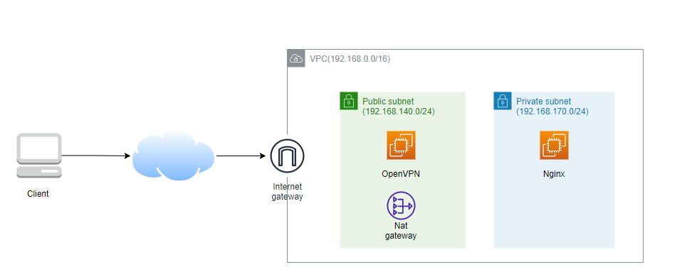

# 개요
* EC2 instnace에 openvpn을 구축할 수 있도록 테라폼으로 인프라 구성

# 인프라 구성도
- 한시간 비용: 약 $0.070
- 하루(24시간) 비용: 약 $1.7
- 한달 비용: 약 $52



# 예제 실습 방법
1. 테라폼으로 aws 인프라 구성
* 약 5분 소요

```bash
# 설치
cd terraform
terrafrom init
terrafrom apply

# ec2 instance ip확인
terraform output
```

2. EC2 instance에 접속하여 openvpn 서버 구축
* [문서 링크](./documents/README.md)

3. 자신 PC에서 openvpn client다운로드 받고 실행

4. [연습문제](./questions/) 풀이

# 예제 삭제 방법
```bash
cd terraform
terrafrom destroy
```

# 참고자료
* https://www.securitronlinux.com/bejiitaswrath/how-to-create-keys-with-easy-rsa-without-a-password-prompt/
* https://www.maths.tcd.ie/~fionn/misc/ec_vpn/
* https://www.freecodecamp.org/news/securing-your-network-connections-using-openvpn/
* https://blog.naver.com/rpg2003a/221209134202
* openvpn CA 공식문서: https://openvpn.net/community-resources/setting-up-your-own-certificate-authority-ca/