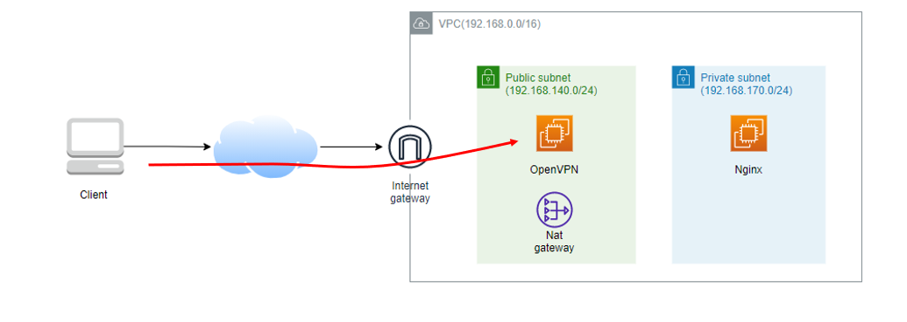
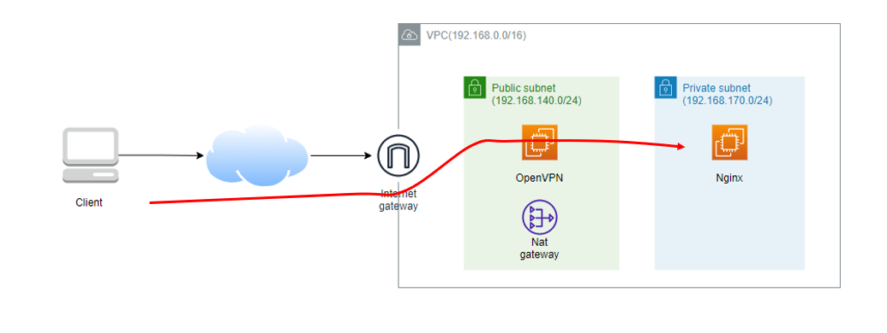

# 문제
* openvpn 구축 후 연습 문제입니다.

### 1. client는 어떻게 openvpn으로 가는 트래픽이 전달될까요?

### 2. aws public subnet에 nginx가 실행되고 있습니다. openvpn을 어떻게 설정해야 client가 nginx에 접근이 가능할까요?

### 3. aws private subnet에 nginx가 실행되고 있습니다. openvpn을 어떻게 설정해야 client가 nginx에 접근이 가능할까요?

# 정답
* [정답 링크](answer.md)
