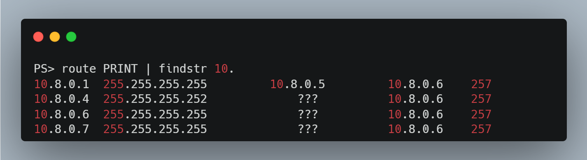

1. client는 어떻게 openvpn으로 가는 트래픽이 전달될까요?
* openvpn connect는 client에 네트워크 인터페이스를 추가하고 라우팅테이블 설정을 추가합니다.

```bash
# 윈도우
ipconfig /all
route PRINT

# 리눅스
ip -c -br addr
ip -c route
```



2. aws public subnet에 nginx가 실행되고 있습니다. openvpn을 어떻게 설정해야 client가 nginx에 접근이 가능할까요?
* openvpn server.conf에서 aws public subnet 라우팅 규칙을 추가합니다.
```conf
push "route 192.168.140.0 255.255.255.0"
```

* openvpn 재시작
```bash
sudo systemctl start openvpn-server@server.service
```


3. aws private subnet에 nginx가 실행되고 있습니다. openvpn을 어떻게 설정해야 client가 nginx에 접근이 가능할까요?
* openvpn server.conf에서 aws private subnet 라우팅 규칙을 추가합니다.
```conf
push "route 192.168.170.0 255.255.255.0"
```

* openvpn 재시작
```bash
sudo systemctl start openvpn-server@server.service
```

* 그리고 openvpn ec2 instance에서 iptaebls규칙을 추가합니다.
```bash
iptables -t nat -A POSTROUTING -s 10.8.0.0/24 -o ens5  -j MASQUERADE
```
